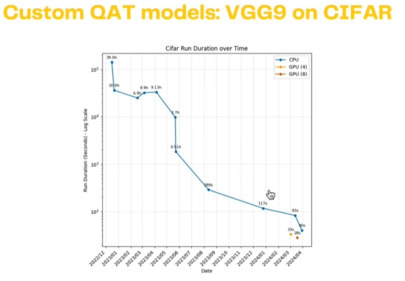

# <center>Brainlock: Fully Homomorphic Encryption (FHE) Subnet</center>

---

The **Brainlock Subnet** leverages Bittensor’s decentralized intelligence network to enable **Fully Homomorphic Encryption (FHE)**-based inference on machine learning (ML) models. Unlike traditional inference systems that operate on plaintext data, Brainlock ensures end-to-end data confidentiality by performing computations directly on encrypted data. Utilizing state-of-the-art frameworks like Zama's Concrete-ML, Brainlock aims to make privacy-preserving computation both practical and efficient for real-world applications.

Miners within the Brainlock network are responsible for executing encrypted inferences on ML models, initially focusing on the VGG9 architecture. Their performance is evaluated based on inference speed and output accuracy, ensuring that only the most optimized and reliable miners are rewarded. Validators play a crucial role in assessing miner outputs against baseline simulations, maintaining the integrity and performance standards of the subnet.

The Brainlock Subnet aspires to revolutionize privacy-centric industries by providing secure, scalable, and efficient encrypted inference capabilities, thereby enabling sensitive data processing without compromising confidentiality.

## 1. Task Presented to the Miners

Miners on the **Brainlock Subnet** are tasked with performing encrypted inference on ML models using **Fully Homomorphic Encryption (FHE)**. Specifically, each miner is required to:

1. **Encrypted Data Processing**: Execute inference on data encrypted with FHE using the VGG9 model—a benchmark in FHE research. Inputs are randomly selected images from a HuggingFace dataset, encrypted with validator-controlled keys to prevent miners from memorizing or hashing inputs. The system will incorporate synthetic images to enhance security and performance.

2. **Model Flexibility**: While the initial focus is on the VGG9 model for its comparability to state-of-the-art (SOTA) metrics in speed and accuracy, the subnet is architected to support more complex models in the future, including components of Large Language Models (LLMs).

3. **Optimization**: Continuously optimize inference latency and accuracy within the stringent constraints of FHE operations. This involves developing faster algorithms, approximations for non-linear operations, and leveraging hardware solutions to reduce computational overhead.

Miners must adhere to these tasks to contribute effectively to the subnet, ensuring that encrypted inference remains both secure and efficient.

## 2. Validator’s Scoring Methodology

Validators are responsible for assessing the performance of miners based on their ability to perform encrypted inferences accurately and swiftly. The evaluation criteria include:

1. **Inference Speed**: Measures the latency of encrypted inference, quantified in milliseconds per instance. Faster inference times are indicative of better optimization and are rewarded accordingly.

2. **Output Accuracy**: Assesses the accuracy of the miner’s decrypted output compared to a baseline generated by the validator. For the VGG9 model, this involves a direct comparison of outputs. For more complex models like LLMs, cosine similarity is used to evaluate the alignment between decrypted responses and expected outputs.

### Detailed Scoring Mechanism

The scoring system is implemented through the `SimplifiedReward` class, which calculates scores based on historical performance and current responses.

- **Response Time Scoring**: Utilizes a Pareto-based distribution to heavily favor faster response times. The score is calculated as:
  
$$\text{Score} = \left(\frac{\text{Scale}}{\text{Response Time}}\right)^\alpha$$

 **Where:**

 - **Scale**: 40.0 seconds, serving as the normalization factor.
 - **Shape Parameter ($\alpha$)**: 3.0, defining the steepness of the distribution.

- **Failure Rate Penalty**: If a miner’s failure rate exceeds 20%, a penalty is applied using an exponential function:

$$\text{Penalty} = \frac{\text{Score}}{1 + \text{Exponential Base}^{(\text{Excess Failure} \times 100)}}$$

 **Where:**

- **Exponential Base**: 2.5
- **Excess Failure**: $\( \text{Failure Rate} - 0.20 \)$

- **Final Score**: The final score is the base score adjusted by any applicable penalties, ensuring a minimum score of 0.0.
## Purpose and Performance

The **Brainlock Subnet** establishes a competitive and secure environment that incentivizes miners to optimize encrypted inference operations, thereby advancing the practical application of Fully Homomorphic Encryption (FHE) in machine learning. Through continuous improvements in inference speed optimization (shown in logarithmic scale below), the subnet aims to make FHE practical for real-world applications:

<p align="center">
  
</p>
<p align="center">
  As seen by the log scale graph above, FHE inference speed is rapidly increasing and on its way to becoming practical.
</p>


**Key objectives include:**

1. **Implementing FHE-Enabled Inference**:
    - Enables computations on encrypted data, maintaining data confidentiality without exposing sensitive information.
2. **Incentivizing Continuous Optimization**:
    - Allocates rewards based on leaderboard scores, encouraging miners to develop faster and more accurate FHE inference solutions.
3. **Enabling Privacy-Centric Applications**:
    - As inference time lowers, industries such as healthcare, finance, and legal will be able to securely infer on sensitive data, complying with privacy regulations like HIPAA.
4. **Scalable and Flexible Architecture**:
    - Allows for arbitrary choice of model via the ZAMA framework. Eventually, we will allow our customers to request models to be served by miners.

The Brainlock Subnet aims to further accelerate progress in FHE optimization by creating a competitive environment that incentivizes continued improvements in inference operations.

---

## Environment Setup Instructions

### Overview

This guide provides step-by-step instructions to set up wallets, register them in the subnet, verify registrations, install necessary tools, clone the required repository, and deploy miners and validators using Docker. Follow each step carefully to ensure a successful setup.

---

### Step 1: Install Dependencies

First, ensure you have the correct version of Bittensor installed:

```bash
pip install bittensor==8.5.1
```

### Step 2: Create Wallets

Depending on the number of miners or validators you intend to run, you can create a single wallet or multiple wallets. There is no functional difference between wallets for miners or validators, and you can name them as you prefer.

#### Create a Miner Wallet

1. **Create a Coldkey**

    ```bash
    btcli wallet new_coldkey --wallet.name miner
    ```

2. **Create a Hotkey**

    ```bash
    btcli wallet new_hotkey --wallet.name miner --wallet.hotkey miner
    ```

#### Create a Validator Wallet

1. **Create a Coldkey**

    ```bash
    btcli wallet new_coldkey --wallet.name validator
    ```

2. **Create a Hotkey**

    ```bash
    btcli wallet new_hotkey --wallet.name validator --wallet.hotkey validator
    ```

---

### Step 3: Register Wallets in the Subnet

Before starting a miner or validator, you must acquire a slot in the subnet.

- **Register a Miner Wallet**

    ```bash
    btcli subnet register --wallet.name miner --wallet.hotkey miner --subtensor.network finney --netuid 55
    ```

- **Register a Validator Wallet**

    ```bash
    btcli subnet register --wallet.name validator --wallet.hotkey validator --subtensor.network finney --netuid 55
    ```

### Step 4: Clone Repository

Clone the repository containing the miner and validator code:

```bash
git clone https://github.com/kingcharlezz/FHE-Subnet.git
```

### Step 5: Navigate to Project Directory and Create Environment File

1. Navigate to the project directory:
   ```bash
   cd FHE/cifar
   ```

2. Create a `.env` file in this directory with the following parameters:

   For Miners:
   ```bash
   # Wallet Configuration
   WALLET_NAME=miner          # Your wallet name
   HOTKEY_NAME=miner         # Your hotkey name
   NETWORK=finney           # Network to connect to
   NETUID=55               # Subnet UID

   # Miner Configuration
   EXTERNAL_PORT=5000      # Port for FHE inference server, **don't** change unless you've manually changed the docker container server config 
   FORCE_VALIDATOR_PERMIT=false ## Testnet Only
   ```

   For Validators:
   ```bash
   # Wallet Configuration
   WALLET_NAME=validator     # Your wallet name
   HOTKEY_NAME=validator    # Your hotkey name
   NETWORK=finney          # Network to connect to
   NETUID=55              # Subnet ID

   # Docker Configuration
   DOCKER_IMAGE=cml_client_cifar_10_8_bit ## Keep this the same for now, May change later
   ```

        Optional variables for validators:
        ```bash
        # Database Configuration -- The values will be generated automatically if they are not specified here
        POSTGRES_USER=specific_user
        POSTGRES_PASSWORD=specific_password
        POSTGRES_DB=miner_data
        ```

### Step 6: Run Setup Scripts

Run the appropriate setup script for your role:

For Miners:
```bash
chmod +x miner_setup.sh
./miner_setup.sh
```
> Give this time to run, with the default compilation steps (5000) it may take over 15 minutes to compile

For Validators:
```bash
chmod +x validator_setup.sh
./validator_setup.sh
```
> This can take 5+ minutes to run

After running the setup scripts, your miner or validator should be operational. Monitor their status using the provided PM2 or Docker commands.

---

### Additional Notes and Protocol Details

- **System Requirements and Protocol Overview**:
    - **Machine Specifications**: A  machine with ~100+ cores is necessary to achieve inference times below 1 minute. The SOTA Times from ZAMA's benchmark use GPUs, but these are not natively supported just yet in our subnet and requires some editing of the codebase
    - **Port Configuration**: Port 5000 must be specified using `--axon.external_port` in the miner configuration. This port is not a traditional axon endpoint, but rather serves as a broadcast to the network indicating where to find the FHE inference Docker container. The network uses this broadcast information to locate and communicate with the inference server.
    - **Epistula Protocol**: The Brainlock subnet implements a secure authentication protocol between miners and validators that:
        - Ensures request authenticity via Bittensor wallet signatures
        - Verifies participant stake requirements 
        - Prevents replay attacks using timestamps
        - Maintains encrypted data transfer channels
        - Handles request signing/verification, stake validation, timestamp checks, and secure header generation through epistula.py


---

## Important Links

- **GitHub Repository**: [https://github.com/kingcharlezz/FHE-Subnet/blob/main/FHE/cifar/README.md](https://github.com/kingcharlezz/FHE-Subnet/blob/main/FHE/cifar/README.md)

---

We look forward to your contributions as we build the future of encrypted machine learning inference. Together, we will redefine data privacy and secure computation.

**Brainlock Subnet Team**
